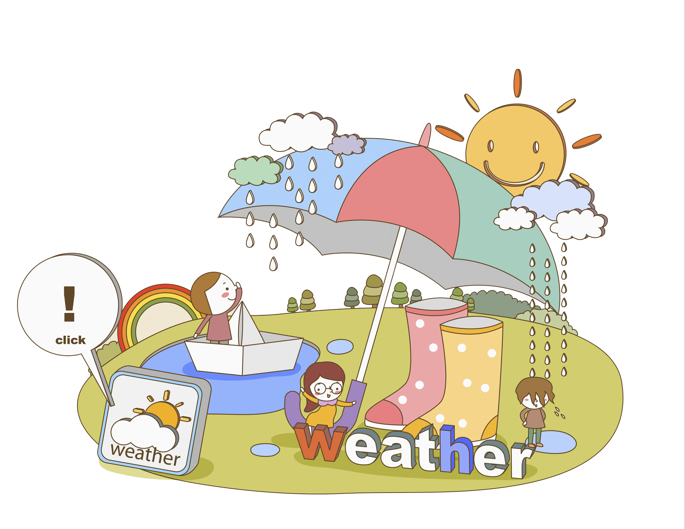

# Weather App

Sitio Web funcional para consultar el clima en cualquier ciudad que la API del clima.

## Tecnologías Utilizadas

1. Javascript
2. HTML
3. Sass
4. Css
5. Visual Studio Code
6. Windows Subsystem for Linux WSL
7. Git
8. GitHub
9. Ubuntu

## Capturas de Pantalla

## Sitios Web de Ayuda

1. Coolors.co
2. Font Awesome
3. Google Fonts
4. Open Weather Map
